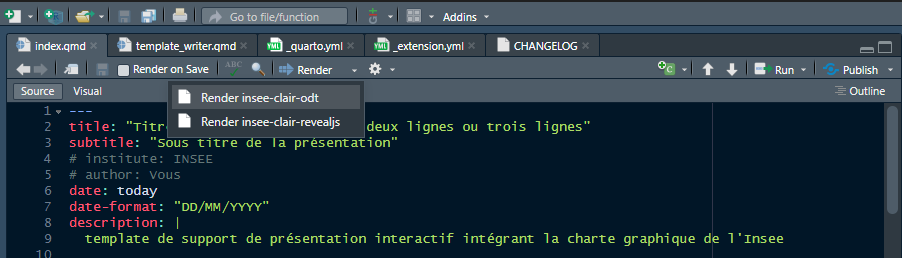
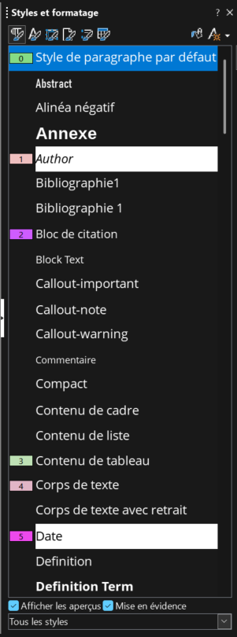
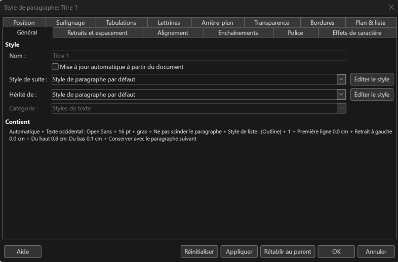

```{r setup}
library(dplyr)
library(gt)
library(flextable)

set_flextable_defaults(
  theme_fun = theme_box,
  font.family = "Open Sans", 
  font.size = 10, 
  border.color = "black",
  border.width = 0.5,
  padding = 2,
  fmt_date = "%d/%m/%Y",
  digits = 2,
  decimal.mark = ",",
  big.mark = " ",
  line_spacing = 1.3,
  na_str = "_")

#Pour consulter tous les paramètres par défaut,
#vous pouvez lancer la fonction suivante dans la console : get_flextable_defaults()

```


# Introduction

Ce support, au format ODT généré par quarto, présente quelques particularités dans sa réalisation par rapport au support généré en revealJs. Ces spécificités et leurs mises en place sont expliquées dans ce template.


# Architecture

Le format ODT a été personnalisé pour une mise en forme spécifique Insee. Ce format est appelé dans le fichier `_quarto.yml` par la ligne suivante :


```yaml
format:
  insee-clair-odt: default
```

Pour générer le fichier au format ODT à partir de votre fichier quarto QMD, il vous faudra procéder de la même manière qu'avec le format revealJs, à savoir cliquer sur la flèche à côté du *"render"* et sélectionner **"insee-clair-odt"**. Une fois le format sélectionné durant votre session RStudio, vous pourrez les fois suivantes cliquer sur *"render"* directement.

{width=100%}

<br/>

:::{.callout-warning}
Attention, l'utilisation de ce format n'est pas compatible avec les fonctionnalités de GitLab, à savoir l'utilisation des pages et la consultation de l'output directement sur internet.
:::

Le format fait référence au format mentionné dans le fichier `_extension.yml`[^1]. Les configurations propres à chaque type de support sont précisées dans ce fichier. Il ne reste dans le fichier `_quarto.yml` que les options de configurations potentiellement compatibles avec plusieurs formats.


[^1]: Ce fichier est présent dans le dossier `_extensions/insee-clair/`.

Ainsi, dans ce fichier, vous pouvez voir que le support quarto généré au format ODT s'appuie sur le template mentionné à la ligne suivante :

```yaml
odt:
  reference-doc: ressources/libreOffice-template.odt
```

C'est dans ce fichier ODT là, dans le volet latéral droit et l'onglet nommé _"Styles et formatage"_ (raccourci F11) que les configurations par défaut sont faites pour chacun des éléments.

{fig-align="center" width=20%}

> La coche en bas à droite nommée *Mise en évidence* permet de visualiser quel formatage est appliqué à chaque ligne.

Ce type d'output offre beaucoup moins de possibilités de mise en forme automatique que le support en revealJs. Néanmoins, il est possible de formater :

- le nom de la police utilisée dans chaque élément ;
- la taille de la police utilisée dans chaque élément ;
- la couleur et le fond de la police utilisés dans chaque élément ;
- les espacements entre chaque élément ;
- etc..

Certains styles et formatages ont donc déjà été réalisés dans ce template et sont compatibles avec la technologie de quarto.

Ces configurations vont vous permettre de reproduire ces styles sur tous les outputs en odt que vous allez générer.

Cependant, certaines configurations ne sont pas prises en compte par quarto et vous devrez donc vous-même appliquer ces styles et formatages à la volée, dans chacun de vos outputs.

Pour ce faire, vous pouvez :

- soit utiliser les styles et formatages récupérés du template et présents dans votre output ;
- soit créer de nouveaux styles et / ou modifier ceux présents dans votre output en faisant un clique droit sur le style puis *Éditer le style...*. La popup suivante apparaît : 

{width=100%}

<br />

Vous pouvez donc via cette fenêtre procéder aux modifications de l'élément souhaité :

- soit sur le template afin que votre modification perdure dans les prochains fichiers générés. 2 possibilités : 
  - Votre modification est compatible avec quarto et sera donc directement visible dans chacun de vos outputs. (modification permanente)
  - Votre modification n'est pas compatible avec quarto. Elle n'apparaîtra pas directement dans vos outputs, mais la configuration sera, elle, reportée dans vos outputs et vous n'aurez plus qu'à l'attribuer aux éléments souhaités en double cliquant sur le formatage désiré. (modification semi-permanente)
- soit directement sur votre output, mais dans ce cas, il vous faudra refaire la manipulation à chaque fois. (modification ponctuelle)

:arrow_right: Maintenant, si vous jugez qu'une modification est souhaitable pour toutes et tous et que vous estimez qu'il s'agit d'un manque dans ce template, n'hésitez pas à faire une issue dans le projet GitLab voire une merge resquest.

:::{.callout-note}
Il est tout à fait possible que je n'ai tout simplement pas pensé à faire ou réussi à faire fonctionner de manière automatique certaines configurations. Dans ce cas là, vous êtes fortement invités à faire une issue ou une Merge Request si vous trouvez une amélioration ou une solution pérenne.

Par exemple, je n'ai pas trouvé le moyen de modifier automatiquement les puces des listes afin de respecter la charte graphique...Peut-être que cela sera possible dans une version supérieure de quarto. En attendant, il est possible de les formater en utilisant les formatages **Liste 1**, **liste 2**, etc.
:::

# La table des matières

Une table des matières est générée automatiquement en fonction des titres (# pour un titre de niveau 1, ## pour un titre de niveau 2, etc..) présents dans votre fichier quarto. Elle doit apparaître en haut de votre document ODT, juste sous la date du jour où le support est généré.

Si celle-ci n'apparaît pas dans le fichier généré avec quarto, alors il s'agit d'un problème d'affichage libreOffice. Pour la visualiser dans votre output, procédez à l'opération suivante :

- Ouvrez le fichier ODT généré avec LibreOffice.
- Faites un clic droit sur le sommaire ou du moins à l'endroit où il devait apparaître (sous la date) et sélectionnez *"Mettre à jour l'index/la table"*.
- Si le sommaire apparaît maintenant, cela signifie qu'il était bien inséré dans le template, mais qu'il devait être mis à jour manuellement.


# Style générique

## Les éléments de la charte graphique

Le support tente de respecter la charte graphique de l'Insee en :

- valorisant la police d'écriture :
  - en Open Sans ;
  - en taille 12 ;
- affichant le nouveau logo :
  - dans l'en-tête de chaque page en haut à gauche ;
  - dans le pied de page en bas à droite ;
  
## Les éléments hors charte graphique

Certains styles et formatages collent à la charte graphique de quarto comme les callouts. D'autres proviennent d'internet comme les émojis qu'il est possible d'intégrer dans l'output ODT.

Pour avoir la liste complète des emojis disponibles, vous pouvez vous rendre sur cette page :

- **[Emoji](https://emojibase.dev/shortcodes/?) :** prendre le texte de la colonne *"Github"*. :innocent:

Contrairement au format revealJs, il n'est pas possible d'intégrer dans le format ODT les icônes *fontawesome* ni les autres extensions utilisées dans ce format.

# Computations

Il est possible d'exécuter du code à la volée comme dans d'autres supports et de générer des équations mathématiques, des tableaux ou des graphiques. Mais pour des raisons liés intrinsèquement à ce support, il n'est pas possible d'y générer des éléments dynamiques.

## Intégration de code

Il est possible d'intégrer le résultat de code R (ou python) dans le support. Par défaut, le code n'est pas visible dans l'output ODT mais il est possible de surcharger cette valeur par défaut en faisant comme suit :

```{r chunk visible et non exécuté}
#| echo: true
#| eval: false

top_species <- starwars %>% group_by(species) %>% count() %>% arrange(-n) %>% ungroup() %>% slice(1)
top_label_species <- top_species %>% pull(species)

cat(paste("En", params$annee, ", l'espèce la plus représentée dans starwars est", top_label_species, "avec", top_species %>% pull(n), "individus. "))

top_planet <- starwars %>% group_by(homeworld) %>% count() %>% arrange(-n) %>% ungroup() %>% slice(1)
top_label_planet <- top_planet %>% pull(homeworld)

cat(paste("La planète la plus représentée est", top_label_planet, "avec", top_planet %>% pull(n),"individus."))
```

## Exécution de code

```{r chunk non visible et exécuté}
#| echo: false
#| output: asis

top_species <- starwars %>% group_by(species) %>% count() %>% arrange(-n) %>% ungroup() %>% slice(1)
top_label_species <- top_species %>% pull(species)

cat(paste0("En ", params$annee, ", l'espèce la plus représentée dans starwars est '", top_label_species, "' avec ", top_species %>% pull(n), " individus. "))

top_planet <- starwars %>% group_by(homeworld) %>% count() %>% arrange(-n) %>% ungroup() %>% slice(1)
top_label_planet <- top_planet %>% pull(homeworld)

cat(paste("La planète la plus représentée est", top_label_planet, "avec", top_planet %>% pull(n),"individus."))
```
<br/>

Dans cet exemple, on peut voir comment il est possible d'injecter des paramètres dans un chunk initialisés dans l'entête yml du fichier quarto :

```yml
params:
  annee: 2025
```

De plus, le code "printé" dans un chunk apparaît stylisé dans l'output ODT. Cependant, les codes en lignes, les mots entourés de backtips, eux, ne le sont pas.

Pour ajouter le style à ce genre de texte, vous pouvez le sélectionner et vous rendre ensuite dans la partie *"Style de caractères"*, puis double cliquer sur la rubrique nommée **Verbatim Char**.

## Les équations mathématiques

Voici des exemples d'équations mathématiques intégrées dans le support :

- 1^ère^ équation mathématique en markdown sur une ligne : $E = mc^{2}$

- 2^ème^ équation mathématique en markdown sur 2 lignes :

$$E = mc^{2}$$

Si les formules mathématiques sont plus complexes, alors il faut passer par la syntaxe du langage *LateX* pour que *Pandoc* puisse bien traduire et afficher la formule :


$$
\text{TCAM} = \sqrt[n]{\frac{\text{valeur finale}}{\text{valeur initiale}}} - 1
$$


## Les graphiques

Il est possible comme avec les autres formats de faire du *cross referencing* en utilisant le label du graphique (cf. @fig-airquality).

Le graphique en sortie dans le fichier ODT est considéré comme une image et peut être configuré comme tel.

Malheureusement, les fonctionnalités de quarto avec ce support ne sont pas encore toutes développées. Nous sommes obligés de faire des configurations à la main pour, par exemple centrer le graphique dans la page.

```{r}
#| label: fig-airquality
#| fig-cap: Temperature and ozone level.
#| fig-width: 5
#| fig-height: 4
#| out-width: "70%"
#| fig-align: "center"

library(ggplot2)

ggplot(airquality, aes(Temp, Ozone)) + 
  geom_point() + 
  geom_smooth(method = "loess")
```

Cependant, ces configurations sont d'ores et déjà plus ou moins implémentées dans le template ODT. Toujours sur cet exemple, vous pouvez placer votre curseur de souris au niveau de votre graphique et vous rendre dans la fenêtre latérale de _"Styles et formatage"_. Double cliquer sur **Figure** pour centrer votre image automatiquement.

De la même manière, double-cliquer sur **Image caption** pour centrer la légende de votre graphique, ou de votre image.

Comme avec revealJs, il est possible de gérer la position des graphiques dans la page :

```{r}
#| layout: [[45,-10, 45]]

plot(cars)
plot(pressure)
```


## Les tableaux

Il est possible de faire des tableaux de 3 manières différentes :

### Un tableau écrit en markdown

<br/>

| Default | Left | Right | Center |
|---------|:-----|------:|:------:|
| 12      | 12   |    12 |   12   |
| 123     | 123  |   123 |  123   |
| 1       | 1    |     1 |   1    |

: Demonstration of pipe table syntax {tbl-colwidths="[40,20,20,20]"}

<br/>

### Un tableau généré en markdown

Dans le tableau suivant, le dataframe en sortie de traitement est généré en tableau normal, avec des bordures à chaque cellule, grâce à l'option suivante présente dans le fichier _extension.yml :

```yml
    df-print: kable
```

Le dataframe est ainsi transformé en markdown pour l'affichage. Cela revient au même d'appeler la fonction suivante en fin de traitement :

```r
knitr::kable(top_vieux)
```

```{r}
#| out-width: "100%"
#| label: tbl-starwars-vieux
#| tbl-cap: "Top five oldest characters of starwars"
#| tbl-colwidths: [30,30,20,20]

top_vieux <- starwars %>% 
  select(name, sex, gender, birth_year) %>% 
  filter(!is.na(birth_year)) %>%
  arrange(-birth_year) %>% slice_head(n = 5)

top_vieux

```

<br />

Voici un exemple ci-dessous de tableau stylisé avec gt, qui rend bien lorsqu'on exécute le chunk dans RStudio mais qui, en sortie dans l'ODT, ne fait pas apparaître les différents styles mis en place. En effet, les fonctions de gt utilisent du style CSS qui n'est pas pris en compte par le format ODT. Il est donc préférable d'utiliser le formatage directement dans LibreOffice pour styliser un tableau modifiable.

<br />

```{r}
#<!-- #| classes: plain -->

top_jeune <- starwars %>% 
  select(name, sex, gender, birth_year) %>% 
  filter(!is.na(birth_year)) %>%
  arrange(birth_year) %>% slice_head(n = 5)

tableau_top_jeune <- as_tibble(top_jeune) %>%
  gt() %>%
  # Augmenter la largeur de la première colonne et aligner à gauche
  tab_style(
    style = cell_text(align = "left"),
    locations = cells_column_labels(columns = name)
  ) %>%
  tab_style(
    style = cell_text(align = "left"),
    locations = cells_body(columns = name)
  ) %>%
  # Centrer les autres colonnes
  tab_style(
    style = cell_text(align = "center"),
    locations = cells_column_labels(columns = c(everything(), -name))
  ) %>%
  tab_style(
    style = cell_text(align = "center"),
    locations = cells_body(columns = c(everything(), -name))
  ) %>%
  # Ajouter des bordures à toutes les cellules
  tab_style(
    style = cell_borders(
      sides = "all",
      weight = px(1),
      color = "black"
    ),
    locations = list(
      cells_column_labels(),
      cells_body()
    )
  ) %>%
  # Augmenter la largeur de la première colonne
  cols_width(
    name ~ px(300),
    everything() ~ px(100)
  )

tableau_top_jeune
```

<br />

:::{.callout-important}
Ces tableaux présentent l'avantage d'être modifiables directement dans l'output généré en ODT.
:::


### Un tableau généré en image

Pour faire une mise en forme du tableau jolie dans le writer mais non modifiable, vous pouvez utiliser le package **`flextable`** dont la documentation se trouve sur [cette page](https://ardata-fr.github.io/flextable-book/index.html).


```{r}
#| #out-width: "50%"
#| label: tbl-starwars-jeune
#| tbl-cap: "Top 5 des personnages les plus jeunes dans Star Wars"
#| tab.layout: "autofit"
#| tab.width: .75


top_jeune <- starwars %>% 
  select(name, sex, gender, birth_year) %>% 
  filter(!is.na(birth_year)) %>%
  arrange(birth_year) %>% slice_head(n = 5) %>%
  flextable() %>% 
   # Aligner le texte à gauche pour la première colonne
  align(j = 1, align = "left", part = "all") %>%
  # Centrer le texte pour les autres colonnes
  align(j = 2:4, align = "center", part = "all") %>%
  # Définir la largeur des colonnes
  width(j = 1, width = 2) %>%  # Première colonne plus large
  width(j = 2:4, width = 1) %>%  # Autres colonnes moins larges
  # Alterner les couleurs de fond des lignes
  bg(i = seq(1, nrow(top_jeune), by = 2), j = 1:4, bg = "#f2f2f2") %>%
  bg(i = seq(2, nrow(top_jeune), by = 2), j = 1:4, bg = "#ffffff") %>%
  # Ajouter des bordures à toutes les cellules
  border_outer(part = "all") %>%
  border_inner(part = "all") %>%
  color(i = ~birth_year < 18, j = "birth_year", color = "red") %>%
  color(i = ~birth_year >= 18, j = "birth_year", color = "black") %>%
  footnote(i = c(1,2), j = 1,
           value = as_paragraph("Personnes mineures selon la République"),
           part = "body") %>%
  add_footer_lines("Source : Package Dplyr 2025") %>%
  align(align = 'left', part = 'footer')

top_jeune <- set_table_properties(top_jeune, width = .75,
                                  layout = "autofit",
                                  opts_word = list(keep_with_next = TRUE))

top_jeune

```

<br/>

:::{.callout-tip}
Pour connaitre davantage les possibilités de mise en forme des tables, vous pouvez vous référer aux liens suivants :

- liste des fonctions possibles :
  - <https://davidgohel.github.io/flextable/reference/index.html>

- la cheatsheet : 
  - <https://ardata-fr.github.io/flextable-book/static/pdf/cheat_sheet_flextable.pdf>

- liste d'exemples d'outputs générés avec le package `flextable` :
  - <https://ardata.fr/en/flextable-gallery/>

:::


# Documentation

Si vous souhaitez approfondir les possibilités de styles et de formatages dans writer, vous pouvez vous référer à la page suivante :

- <https://help.libreoffice.org/latest/fr/text/swriter/guide/main.html>

Pour comprendre et faire la distinction entre ce qui est configuré de manière automatique et ce qui ne l'est pas mais qui est pré-formaté dans l'output, vous pouvez faire la comparaison entre l'output de ce fichier quarto (en faisant le render) et le rendu final hébergé dans ce projet dans le dossier suivant : `_extensions/insee-clair/ressources/template_writer_Final.odt`.


